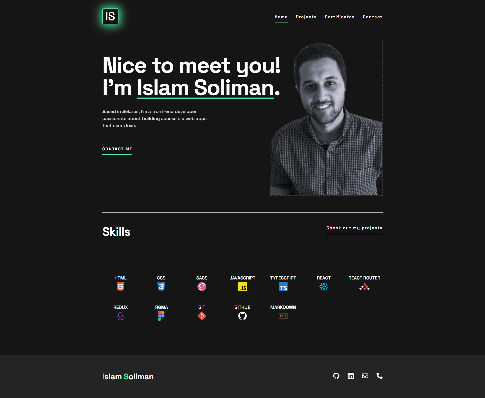

# My Personal Portfolio

Welcome to my personal portfolio, showcasing my skills and experience as a frontend developer. Here, you'll find a collection of projects that demonstrate my proficiency in building responsive, interactive, and user-friendly web applications.

## Table of contents

- [Screenshot](#screenshot)
- [Links](#links)
- [Built with](#built-with)
- [Author](#author)

### Screenshot

### Links

- [Github Repository](https://github.com/simokitkat/IslamSoliman)
- Live Site URL: [Islam Soliman](https://islam-soliman.netlify.app/)

### Built with

- [React](https://reactjs.org/) - JS library
- [React Router Dom](https://reactrouter.com/) - Routing library
- [Redux Toolkit](https://redux-toolkit.js.org/) - State management library
- [Sass](https://sass-lang.com/) - CSS preprocessor
- [Framer Motion](https://www.framer.com/motion/) - Animation library
- [Vite](https://vitejs.dev/) - Build tool

## Author

- [Frontend Mentor](https://www.frontendmentor.io/profile/simokitkat)
- [Linkedin](https://www.linkedin.com/in/islamsoliman92)
